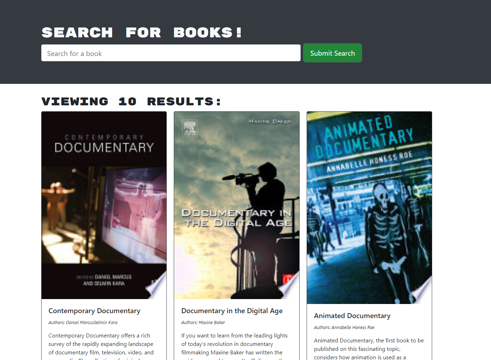

# Book-Search-Engine-MERN

 # Description
 
This application uses the google search engine RESTful API, and converts it to use GraphQL
 # Table of Contents
 
 * [Installation](#installation)
 * [Useage](#useage)
 * [Contributing](#contributing)
 * [License](#license)
 * [Questions](#questions)

 # Installation
 npm i with dependancies 

 # Useage
 Search engine that will allow you to search google database for books using MongoDB. 
 
 
 
 

 # Contributing
 This app was created by Jason Bolton
 

 # License
  Licensed under MIT.
  For more information, visit this link.
  https://opensource.org/licenses/MIT
  
  
# Questions
For more examples of my work, please visit my GitHub at [Jbolton89](https://github.com/jbolton89)
or contact me at
jasonbolton89@gmail.com